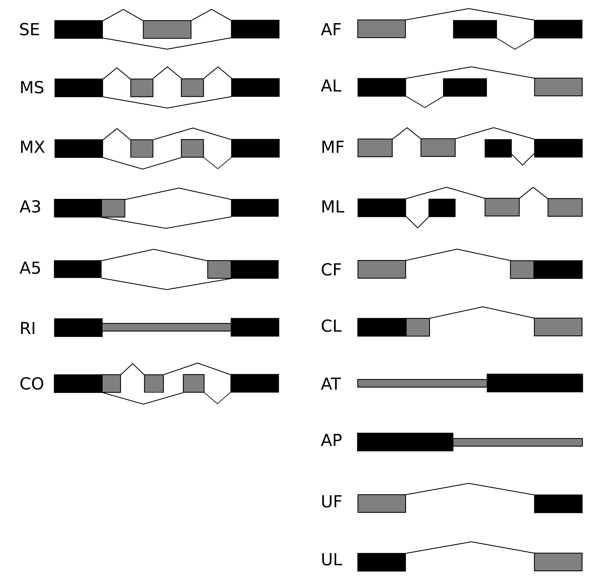

# inferPairwiseEvents

usage: infer_pairwise_events.py [-h] [--transcript_gtf TRANSCRIPT_GTF]  
                                --outdir OUTDIR  
                                [--min_exon_length MIN_EXON_LENGTH]  
                                [--min_intron_length MIN_INTRON_LENGTH]  
                                [--max_exon_length MAX_EXON_LENGTH]  
                                [--max_intron_length MAX_INTRON_LENGTH]  
                                [--dump_pkl_file]  
                                [--bedtools_path BEDTOOLS_PATH]  
                                [--suppress_output]  

optional arguments:  
  -h, --help            show this help message and exit  
  --transcript_gtf TRANSCRIPT_GTF
                        Full transcript gtf file. Not required, but if not
                        provided a transcript dict must be passed as a
                        parameter to the main function.  
  --outdir OUTDIR       Path to output directory  
  --min_exon_length MIN_EXON_LENGTH
                        Minimum allowable exon length in input gtf.
                        Transcripts with shorter exons will be filtered.
                        (default: 3)  
  --min_intron_length MIN_INTRON_LENGTH
                        Minimum allowable intron length in input gtf.
                        Transcripts with shorter introns will be filtered.
                        (default: 20)  
  --max_exon_length MAX_EXON_LENGTH
                        Maximum allowable exon length in input gtf.
                        Transcripts with longer exons will be filtered
                        (default = 35000)  
  --max_intron_length MAX_INTRON_LENGTH
                        Maximum allowable intron length in input gtf.
                        Transcripts with longer introns will be fitlered
                        (default = 1000000)  
  --dump_pkl_file       If set, program will dump pickle file of event dict.  
  --bedtools_path BEDTOOLS_PATH
                        Path to bedtools executable (default = 'bedtools')  
  --suppress_output     If set, GTF, GFF3, and IOE files will not be written.  
